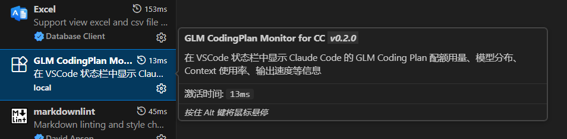

# GLM CodingPlan Monitor for CC

VSCode 扩展，在状态栏中实时监控 Claude Code 使用 GLM Coding Plan 时的 Token 用量、模型分布、Context 使用率、输出速度等信息。



## 截图预览

### 状态栏

扩展在 VSCode 底部状态栏实时显示多项监控数据，从左到右依次为：当前模型名称、Context 使用率进度条、输出速度（tokens/s）、API 调用次数、套餐等级、配额百分比、24h Token 用量总量。


### Context 使用率

鼠标悬停在 Context 进度条上，可查看当前上下文窗口的已用量和总量。进度条颜色会随使用率变化：**≤50% 默认色，>50% 橙色，>80% 红色**。


### 配额详情

鼠标悬停在配额区域，可查看 5小时滚动窗口、周限额、MCP 限额的详细百分比及下次重置时间。配额文字颜色会随使用率变化：**≤70% 默认色，>70% 橙色，>90% 红色**。


### 用量详情

鼠标悬停在 24h Token 用量上，可查看各时间段的总量及按模型拆分的详细用量。点击该项可打开完整的分时段柱状图面板。


### Session 信息

显示当前活跃会话的模型和 Session ID，点击可复制完整 ID。


### 分时段柱状图面板

点击状态栏打开面板，顶部展示配额卡片和四个时间维度的用量汇总。支持切换 **24小时 / 当天 / 近7天 / 近30天** 四种视图，柱状图按模型分色堆叠，鼠标悬停可查看该时段各模型精确用量（带颜色圆点标记）。


## 功能

- **状态栏实时显示**：当前模型、Context 使用率、输出速度、API 调用次数、配额进度、24h Token 用量
- **分时段柱状图**：支持 24小时 / 当天 / 近7天 / 近30天 四种视图，按模型分色堆叠
- **Tooltip 详情**：悬停柱子查看该时段各模型精确用量（带颜色标记）
- **配额监控**：5小时滚动窗口、周限额、MCP 限额的百分比及重置时间
- **用量统计与官方一致**：当天从0点起，近7天/近30天按自然日计算
- **Session 管理**：显示当前 Session ID，方便排查问题

## 前置条件

本扩展专为使用 **GLM Coding Plan** 的 Claude Code 用户设计，需要以下条件：

1. **已安装 Claude Code CLI**（`claude` 命令可用）
2. **已配置 GLM Coding Plan 接入**，即 `~/.claude/settings.json` 中包含以下字段：

```json
{
  "env": {
    "ANTHROPIC_BASE_URL": "https://your-glm-proxy-url/api/anthropic",
    "ANTHROPIC_AUTH_TOKEN": "your-token-here"
  }
}
```

> 以上配置通常在购买 GLM Coding Plan 后按官方指引操作即可自动完成，无需手动配置。

1. **Node.js >= 18**（编译安装时需要）

## 安装

### 方式一：手动编译安装（推荐）

```bash
# 1. 克隆仓库
git clone https://github.com/brucetw/vscode-glm-codingplan-monitor-for-cc.git

# 2. 进入目录
cd vscode-glm-codingplan-monitor-for-cc

# 3. 安装依赖
npm install

# 4. 编译并打包为 vsix
npx vsce package

# 5. 安装到 VSCode
code --install-extension vscode-glm-codingplan-monitor-for-cc-0.2.0.vsix
```

### 方式二：让 AI 帮你安装

将本仓库链接发给 Claude Code 或其他 AI，说「帮我安装这个 VSCode 扩展」即可。AI 会自动执行上述步骤。

### 方式三：直接安装 vsix

如果已有编译好的 `.vsix` 文件：

```bash
code --install-extension vscode-glm-codingplan-monitor-for-cc-0.2.0.vsix
```

或在 VSCode 中：`Ctrl+Shift+P` → 输入 `Extensions: Install from VSIX...` → 选择 vsix 文件。

### 安装后

1. 重新加载 VSCode 窗口（`Ctrl+Shift+P` → `Reload Window`）
2. 底部状态栏应自动出现监控数据
3. 如果看不到数据，确认 Claude Code 正在运行且有活跃会话

## 使用方式

- 扩展在 VSCode 启动后自动激活，状态栏实时显示监控数据
- 点击状态栏的 **24h Token 用量** 项，打开分时段柱状图面板
- 面板上方标签页可切换不同时间视图
- 鼠标悬停状态栏各项可查看详细 Tooltip

## 支持的模型颜色

| 模型 | 颜色 |
|------|------|
| GLM-5.1 | 🔵 蓝色 |
| GLM-5-Turbo | 🟢 绿色 |
| GLM-5V-Turbo | 🟡 橙色 |
| GLM-5 | 🟣 紫色 |
| GLM-4.7 | 🟠 深橙色 |
| GLM-4 | 🔴 红色 |
| GLM-4.6V | 🟤 棕色 |

## 可配置项

通过 VSCode 设置（`Ctrl+,`）搜索 `glmMonitor` 可配置：

| 设置项 | 默认值 | 说明 |
|--------|--------|------|
| `glmMonitor.refreshInterval` | 1000 | 数据刷新间隔（毫秒） |
| `glmMonitor.showTokenUsage` | true | 显示 24h Token 用量 |
| `glmMonitor.showModel` | true | 显示模型名称 |
| `glmMonitor.showContext` | true | 显示 Context 使用率 |
| `glmMonitor.showSpeed` | true | 显示输出速度 |
| `glmMonitor.showPrompts` | true | 显示 API 调用次数 |
| `glmMonitor.showQuota` | true | 显示配额信息 |

## 致谢

本项目参考了以下开源项目，感谢作者的贡献：

- [glm-plan-usage2](https://github.com/zwen64657/glm-plan-usage2)
- [glm-cc-tps](https://github.com/xkwy521/glm-cc-tps)

## 许可

MIT
