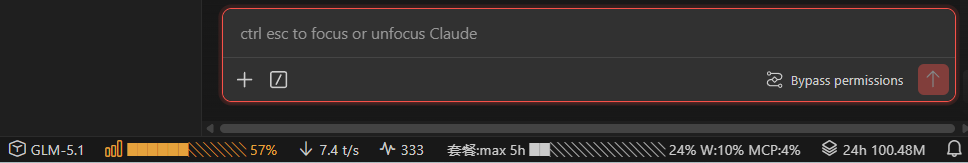
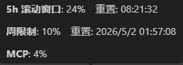
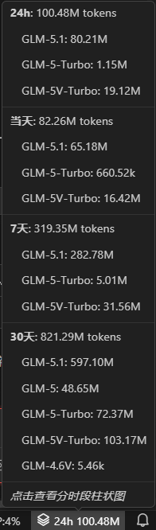
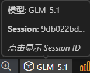
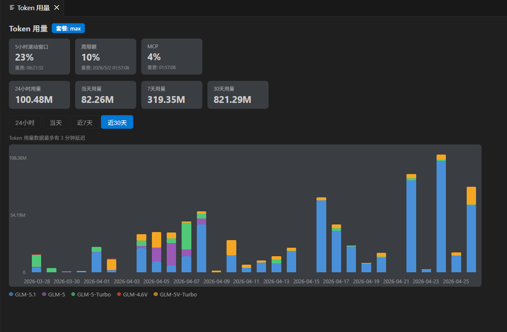

# GLM CodingPlan Monitor for CC

VSCode 扩展，在状态栏中实时监控 Claude Code 使用 GLM Coding Plan 时的 Token 用量、模型分布、Context 使用率、输出速度等信息。

## 截图预览

### 状态栏

扩展在 VSCode 底部状态栏实时显示多项监控数据，从左到右依次为：当前模型名称、Context 使用率进度条、输出速度（tokens/s）、API 调用次数、套餐等级、配额百分比、24h Token 用量总量。



### 配额详情

鼠标悬停在配额区域，可查看 5小时滚动窗口、周限额、MCP 限额的详细百分比及下次重置时间。



### 用量详情

鼠标悬停在 24h Token 用量上，可查看各时间段的总量及按模型拆分的详细用量。点击该项可打开完整的分时段柱状图面板。



### Session 信息

显示当前活跃会话的模型和 Session ID，点击可复制完整 ID。



### 分时段柱状图面板

点击状态栏打开面板，顶部展示配额卡片和四个时间维度的用量汇总。支持切换 **24小时 / 当天 / 近7天 / 近30天** 四种视图，柱状图按模型分色堆叠，鼠标悬停可查看该时段各模型精确用量（带颜色圆点标记）。



## 功能

- **状态栏实时显示**：当前模型、Context 使用率、输出速度、API 调用次数、配额进度、24h Token 用量
- **分时段柱状图**：支持 24小时 / 当天 / 近7天 / 近30天 四种视图，按模型分色堆叠
- **Tooltip 详情**：悬停柱子查看该时段各模型精确用量（带颜色标记）
- **配额监控**：5小时滚动窗口、周限额、MCP 限额的百分比及重置时间
- **用量统计与官方一致**：当天从0点起，近7天/近30天按自然日计算
- **Session 管理**：显示当前 Session ID，方便排查问题

## 安装

```bash
# 下载 vsix 文件后安装
code --install-extension glm-codingplan-monitor-for-cc-0.2.0.vsix
```

或手动编译：

```bash
git clone https://github.com/brucetw/glm-codingplan-monitor-for-cc.git
cd glm-codingplan-monitor-for-cc
npm install
npx vsce package
code --install-extension glm-codingplan-monitor-for-cc-0.2.0.vsix
```

## 前置条件

本扩展需要读取以下配置（通常由 GLM Coding Plan 的 Claude Code 接入方式自动配置）：

- `~/.claude/settings.json` 中的 `ANTHROPIC_BASE_URL` 和 `ANTHROPIC_AUTH_TOKEN`
- 或对应的环境变量

## 使用方式

- 扩展在 VSCode 启动后自动激活，状态栏实时显示监控数据
- 点击状态栏的 **24h Token 用量** 项，打开分时段柱状图面板
- 面板上方标签页可切换不同时间视图
- 鼠标悬停状态栏各项可查看详细 Tooltip

## 支持的模型颜色

| 模型 | 颜色 |
|------|------|
| GLM-5.1 | 🔵 蓝色 |
| GLM-5-Turbo | 🟢 绿色 |
| GLM-5V-Turbo | 🟡 橙色 |
| GLM-5 | 🟣 紫色 |
| GLM-4.7 | 🟠 深橙色 |
| GLM-4 | 🔴 红色 |
| GLM-4.6V | 🟤 棕色 |

## 可配置项

通过 VSCode 设置（`Ctrl+,`）搜索 `glmMonitor` 可配置：

| 设置项 | 默认值 | 说明 |
|--------|--------|------|
| `glmMonitor.refreshInterval` | 1000 | 数据刷新间隔（毫秒） |
| `glmMonitor.showTokenUsage` | true | 显示 24h Token 用量 |
| `glmMonitor.showModel` | true | 显示模型名称 |
| `glmMonitor.showContext` | true | 显示 Context 使用率 |
| `glmMonitor.showSpeed` | true | 显示输出速度 |
| `glmMonitor.showPrompts` | true | 显示 API 调用次数 |
| `glmMonitor.showQuota` | true | 显示配额信息 |

## 许可

MIT
